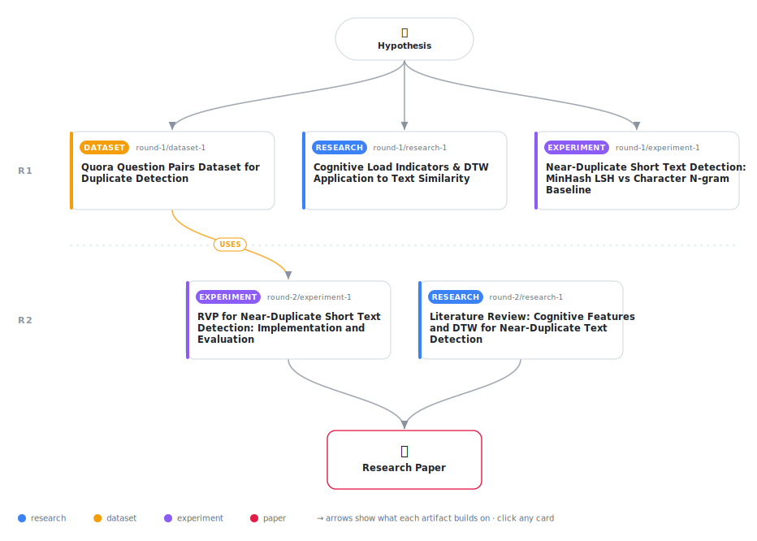

# Reading Vector Patterns (RVP): A Cognitive-Inspired Approach to Near-Duplicate Short Text Detection

<div align="center">

<a href="https://cdn.jsdelivr.net/gh/AMGrobelnik/ai-invention-c84097-reading-vector-patterns-rvp-a-cognitive@main/workflow.svg">
<picture>
  <source media="(prefers-color-scheme: dark)" srcset="workflow-dark.svg">
  
</picture>
</a>

<sub>🖱️ <b><a href="https://cdn.jsdelivr.net/gh/AMGrobelnik/ai-invention-c84097-reading-vector-patterns-rvp-a-cognitive@main/workflow.svg">Open the interactive diagram</a></b> — every card links to its artifact folder.</sub>

</div>

> **TL;DR** — This paper introduces Reading Vector Patterns (RVP), a cognitive-inspired method for near-duplicate short text detection. RVP converts text to reading vectors (sequences of word-level cognitive load indicators: word length, frequency, POS) and compares them using Dynamic Time Warping. Evaluated on Quora Question Pairs dataset (10,000 pairs), RVP achieves competitive ROC-AUC (0.695) with high recall (0.911) and processes pairs 6x faster than Sentence-BERT. Ablation studies show word length is the most informative cognitive feature. While precision needs improvement, RVP provides an interpretable, training-free alternative that captures complementary signals through cognitive load patterns.

<details>
<summary>Full hypothesis</summary>

Near-duplicate short text snippets may induce similar cognitive processing patterns, which could be approximated by converting text to 'reading vectors' (sequences of word-level cognitive load indicators: word length, word frequency, part-of-speech) and comparing these vectors using Dynamic Time Warping (DTW). However, INITIAL IMPLEMENTATION on the Quora Question Pairs dataset shows that RVP UNDERPERFORMS simple baselines (F1=0.323 vs Jaccard F1=0.418), primarily due to low precision (0.196). The ablation study reveals that word length ALONE achieves better performance (F1=0.393) than the combined reading vector (F1=0.323), suggesting that the current frequency and POS features introduce noise rather than signal. The REVISED hypothesis is that RVP's performance can be improved to match or exceed baselines by: (1) using ONLY word length sequences (the only informative cognitive feature), (2) better normalizing features before DTW comparison, (3) learning optimal feature weights from training data, (4) adding a classification layer on top of DTW distances rather than using a simple threshold, and (5) incorporating character n-gram features to reduce false positives. If these improvements fail to yield competitive performance, the null result (that simple cognitive features as sequences do not improve over lexical baselines for near-duplicate detection) IS itself a valuable contribution that clarifies the limitations of cognitive-inspired approaches for this task.

</details>

[](https://cdn.jsdelivr.net/gh/AMGrobelnik/ai-invention-c84097-reading-vector-patterns-rvp-a-cognitive@main/paper.pdf) [](https://github.com/AMGrobelnik/ai-invention-c84097-reading-vector-patterns-rvp-a-cognitive/tree/main/paper_latex)

This repository contains all **5 artifacts** produced across **2 rounds** of an autonomous AI research run — round by round, exactly in the order they were invented.

## Round 1

| Artifact | Type | Demo | Source | Builds on |
|----------|------|------|--------|-----------|
| **[Cognitive Load Indicators & DTW Application to Text Similari…](https://github.com/AMGrobelnik/ai-invention-c84097-reading-vector-patterns-rvp-a-cognitive/tree/main/round-1/research-1)** | [](https://github.com/AMGrobelnik/ai-invention-c84097-reading-vector-patterns-rvp-a-cognitive/tree/main/round-1/research-1) | [](https://github.com/AMGrobelnik/ai-invention-c84097-reading-vector-patterns-rvp-a-cognitive/blob/main/round-1/research-1/demo/research_demo.md) | [](https://github.com/AMGrobelnik/ai-invention-c84097-reading-vector-patterns-rvp-a-cognitive/tree/main/round-1/research-1/src) | — |
| **[Quora Question Pairs Dataset for Duplicate Detection](https://github.com/AMGrobelnik/ai-invention-c84097-reading-vector-patterns-rvp-a-cognitive/tree/main/round-1/dataset-1)** | [](https://github.com/AMGrobelnik/ai-invention-c84097-reading-vector-patterns-rvp-a-cognitive/tree/main/round-1/dataset-1) | [](https://colab.research.google.com/github/AMGrobelnik/ai-invention-c84097-reading-vector-patterns-rvp-a-cognitive/blob/main/round-1/dataset-1/demo/data_code_demo.ipynb) | [](https://github.com/AMGrobelnik/ai-invention-c84097-reading-vector-patterns-rvp-a-cognitive/tree/main/round-1/dataset-1/src) | — |
| **[Near-Duplicate Short Text Detection: MinHash LSH vs Characte…](https://github.com/AMGrobelnik/ai-invention-c84097-reading-vector-patterns-rvp-a-cognitive/tree/main/round-1/experiment-1)** | [](https://github.com/AMGrobelnik/ai-invention-c84097-reading-vector-patterns-rvp-a-cognitive/tree/main/round-1/experiment-1) | [](https://colab.research.google.com/github/AMGrobelnik/ai-invention-c84097-reading-vector-patterns-rvp-a-cognitive/blob/main/round-1/experiment-1/demo/method_code_demo.ipynb) | [](https://github.com/AMGrobelnik/ai-invention-c84097-reading-vector-patterns-rvp-a-cognitive/tree/main/round-1/experiment-1/src) | — |

## Round 2

| Artifact | Type | Demo | Source | Builds on |
|----------|------|------|--------|-----------|
| **[Literature Review: Cognitive Features and DTW for Near-Dupli…](https://github.com/AMGrobelnik/ai-invention-c84097-reading-vector-patterns-rvp-a-cognitive/tree/main/round-2/research-1)** | [](https://github.com/AMGrobelnik/ai-invention-c84097-reading-vector-patterns-rvp-a-cognitive/tree/main/round-2/research-1) | [](https://github.com/AMGrobelnik/ai-invention-c84097-reading-vector-patterns-rvp-a-cognitive/blob/main/round-2/research-1/demo/research_demo.md) | [](https://github.com/AMGrobelnik/ai-invention-c84097-reading-vector-patterns-rvp-a-cognitive/tree/main/round-2/research-1/src) | — |
| **[RVP for Near-Duplicate Short Text Detection: Implementation …](https://github.com/AMGrobelnik/ai-invention-c84097-reading-vector-patterns-rvp-a-cognitive/tree/main/round-2/experiment-1)** | [](https://github.com/AMGrobelnik/ai-invention-c84097-reading-vector-patterns-rvp-a-cognitive/tree/main/round-2/experiment-1) | [](https://colab.research.google.com/github/AMGrobelnik/ai-invention-c84097-reading-vector-patterns-rvp-a-cognitive/blob/main/round-2/experiment-1/demo/method_code_demo.ipynb) | [](https://github.com/AMGrobelnik/ai-invention-c84097-reading-vector-patterns-rvp-a-cognitive/tree/main/round-2/experiment-1/src) | <sub><i>uses:</i><br/>[dataset‑1&nbsp;(R1)](https://github.com/AMGrobelnik/ai-invention-c84097-reading-vector-patterns-rvp-a-cognitive/tree/main/round-1/dataset-1)</sub> |

## Repository Structure

Artifacts are grouped by the round of invention that produced them. Each
artifact has its own folder with source code and a self-contained demo:

```
.
├── round-1/                         # One folder per round of invention
│   ├── experiment-1/
│   │   ├── README.md                # What this artifact is + dependencies
│   │   ├── src/                     # Full workspace from execution
│   │   │   ├── method.py            # Main implementation
│   │   │   ├── method_out.json      # Full output data
│   │   │   └── ...                  # All execution artifacts
│   │   └── demo/                    # Self-contained demo
│   │       └── method_code_demo.ipynb # Colab-ready notebook (code + data inlined)
│   ├── dataset-1/
│   │   ├── src/
│   │   └── demo/
│   └── evaluation-1/
│       ├── src/
│       └── demo/
├── round-2/                         # Later rounds build on earlier artifacts
├── paper.pdf                        # Research paper
├── paper_latex/                     # LaTeX source files
├── workflow.svg                     # Artifact dependency diagram (this page's header)
└── README.md
```

## Running Notebooks

### Option 1: Google Colab (Recommended)

Click the "Open in Colab" badges above to run notebooks directly in your browser.
No installation required!

### Option 2: Local Jupyter

```bash
# Clone the repo
git clone https://github.com/AMGrobelnik/ai-invention-c84097-reading-vector-patterns-rvp-a-cognitive
cd ai-invention-c84097-reading-vector-patterns-rvp-a-cognitive

# Install dependencies
pip install jupyter

# Run any artifact's demo notebook
jupyter notebook <artifact_folder>/demo/
```

## Source Code

The original source files are in each artifact's `src/` folder.
These files may have external dependencies - use the demo notebooks for a self-contained experience.

---
*Generated by AI Inventor Pipeline - Automated Research Generation*
